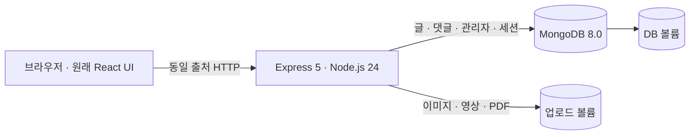

# Temp-Log

`monitor5/sspark_portpolio`의 **React 화면·관리자 편집기·Express API·MongoDB 모델을 가져와 문제를 수정**한 개인 블로그/포트폴리오다. 홈, 프로젝트/에세이 상세, 갤러리, 검색, 댓글, Markdown 편집과 파일 업로드를 유지한다. 다른 CMS는 설계 참고만 했으며 서비스로 실행하지 않는다.

이전 Ghost 교체 구현은 `archive/ghost-prototype` 브랜치에 보관했다. 기존 Ghost/MySQL 볼륨과 원본 저장소는 삭제하지 않는다. [원본 출처와 변경 범위](docs/PROVENANCE.md), [개선 참고 자료](docs/IMPROVEMENTS.md).

## 실행

Docker Compose, Make, Python 3가 필요하다.

```sh
make up
make admin
```

- 블로그: <http://localhost:8080>
- 관리자: <http://localhost:8080/admin>
- `make admin`에서 본인 사용자명과 새 비밀번호를 입력한다. 비밀번호는 화면·명령 인자·저장소에 기록하지 않는다. 최소 14자, UTF-8 최대 72바이트다.
- `.env`는 `make init` 때 난수로 만들고 이후 유지한다. 관리자 계정은 웹에서 익명 생성할 수 없다.

```sh
make status       # 상태
make logs         # 로그
make down         # 종료, DB/업로드 볼륨 유지
make backup       # 서비스 중단 → Mongo 데이터와 업로드 함께 백업 → 재시작
make admin-reset  # 관리 권한이 있는 터미널에서 비밀번호 변경, 기존 세션 폐기
```

## 원본을 유지하며 고친 부분

| 원본 기능 | 유지·수정 |
| --- | --- |
| 홈·갤러리·카드·타이포그래피·스크롤 모션 | 기존 컴포넌트와 스타일 유지. 영문 폰트는 같은 폰트를 자체 제공 |
| 관리자 로그인 | localStorage JWT → HttpOnly/SameSite 서버 세션, MongoDB에 저장 |
| 글 작성·수정 | 새 글은 초안 기본값. 관리자만 숨김 글 조회, 공개 저장은 명시적 선택 |
| HTML/Markdown 미리보기 | 공통 sanitizer, 영상 유지, YouTube/Vimeo만 제한된 iframe 허용 |
| 업로드 | 실제 파일 형식 확인, 이미지 디코드/재인코딩, UUID 파일명, 파일/전체 용량 제한, PDF 첨부 |
| 댓글 | 원래 비회원 댓글/비밀번호 삭제 유지, 초안 댓글 접근 차단, 입력·조회 수 제한 |
| 관리자 목록 | 서버 한도에 맞춘 페이지 이동, 모바일/키보드 조작, 실패 표시 |
| 연락처 | 예시 학교 주소·전화번호를 개인 설정으로 분리, 문의는 메일 앱으로 연결 |
| 운영 | 비루트 Docker, 영구 볼륨, DB 권한 분리, readiness/liveness, 정상 종료 |

프로필·연락처·소셜 링크는 `client/src/site.ts`에서 실제 공개할 값으로 채운다. 임의 연락처로 메일을 보내지 않도록 기본값은 비워 뒀다. 원래 화면 구성을 유지하며 로고·페이지·관리자 화면의 서비스명은 Temp-Log로 통일했다. 기본 시드 콘텐츠와 공용 관리자 비밀번호는 제공하지 않는다.

업로드한 파일은 `/uploads/...` URL을 알면 읽을 수 있다. **초안 본문 비공개와 파일 비공개는 별개**이며 이 앱은 비밀 문서 보관함이 아니다. PDF는 다운로드로 제공하고 SVG/HTML 파일 업로드는 차단한다.

## 기술 구조



[Docker/Kubernetes 구조도](docs/ARCHITECTURE.md) · [Kubernetes 배포](docs/KUBERNETES.md) · [백업과 복구](docs/RESTORE.md)

기본 주소는 localhost에만 열리고 DB 포트는 호스트에 공개하지 않는다. 실제 운영에는 HTTPS, 올바른 `PUBLIC_URL`, 신뢰하는 프록시 경로, 스토리지·백업 설정이 필요하다. 외부 운영 배포는 이 작업에 포함하지 않는다. 업로드와 메모리 기반 rate limit 때문에 app은 **1 replica + Recreate**로 운영한다. 서버 세션만 공유한다고 수평 확장이 완료되는 것은 아니다.

## 개발·검증

Node.js 24.21 이상 24.x와 MongoDB가 필요하다. 일반 개발 실행은 `SESSION_SECRET`, `MONGO_URI`, `PUBLIC_URL=http://localhost:5173`을 셸에 설정한 뒤 `npm run dev`를 실행한다. Vite가 `/api`와 `/uploads`를 서버 4000으로 전달한다.

```sh
npm ci --ignore-scripts
npm run build
npm test
npm audit
```

통합 시험은 새 DB를 가진 별도 환경에서만 실행한다.

```sh
export COMPOSE_PROJECT_NAME=temp-log-test-local
export APP_PORT=8081 PUBLIC_URL=http://localhost:8081
make up
python3 tests/smoke.py create
# 컨테이너를 다시 만들어도 볼륨과 세션이 유지되는지 확인
docker compose up -d --force-recreate --wait --wait-timeout 240
python3 tests/smoke.py verify
# 생성한 테스트 데이터만 삭제
docker compose down -v
unset COMPOSE_PROJECT_NAME APP_PORT PUBLIC_URL
```

재시험은 이전 `artifacts/original-smoke.json`과 `.cookies`를 정리한 뒤 새 테스트 DB에서 진행한다. `create`는 이미 관리자가 있는 DB에 덮어쓰지 않는다. 실제 사용 DB에 테스트를 실행하지 않는다.

[수정 근거](docs/AUDIT.md) · [검증 결과와 한계](docs/VALIDATION.md) · [라이선스](docs/LICENSE_REVIEW.md) · [보안 운영](SECURITY.md)


## 브라우저 QA

[브라우저 QA 결과와 개선 내역](docs/BROWSER_QA.md). 실제 Chromium으로 UI를 조작하며, 테스트 데이터·비밀번호는 별도 환경에만 만든다. 테스트에는 관리자 비밀번호 초기화, DB 중단/복구, 고의 로그인 제한 도달이 포함되므로 실사용 인스턴스를 대상으로 실행하지 않는다.

```sh
APP_PORT=8081 PUBLIC_URL=http://localhost:8081 docker compose -p temp-log-test-qa up --build --force-recreate -d --wait --wait-timeout 240
npm run qa:prepare
npx playwright install chromium
npm run test:browser
```

macOS에 설치된 Chrome을 사용하려면 `QA_BROWSER_EXECUTABLE='/Applications/Google Chrome.app/Contents/MacOS/Google Chrome' npm run test:browser`로 실행한다. 재시험할 때는 QA 컨테이너를 재생성해 고의로 발생시킨 메모리 rate limit을 초기화한다. QA DB 볼륨을 지웠다면 `artifacts/qa-private.json`도 지운 후 새로 준비한다. 실사용 DB·업로드·관리자 계정은 건드리지 않는다.

테스트의 네트워크/세션 trace는 저장하지 않는다. CI에는 안전한 결과 JSON과 QA 화면만 보관하며 `artifacts/qa-private.json`은 업로드하지 않는다.
