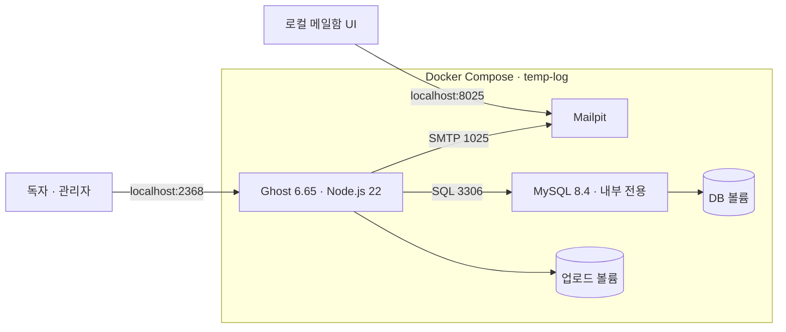
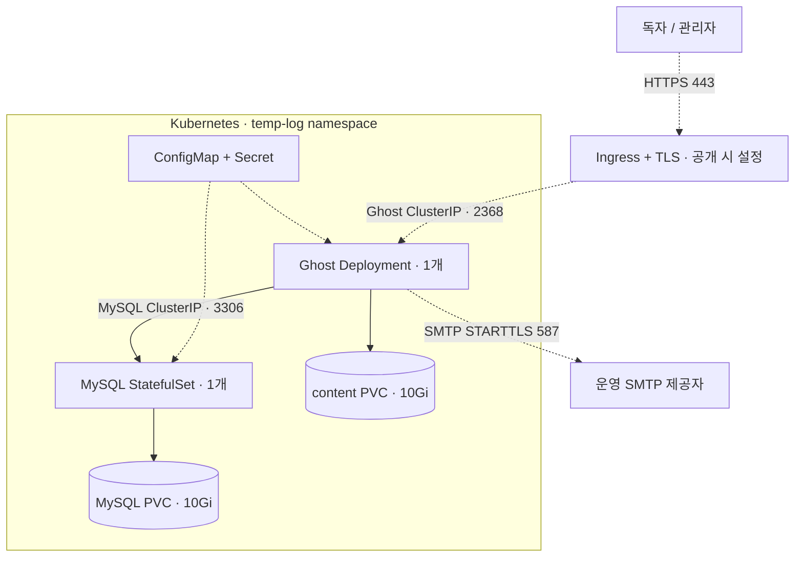
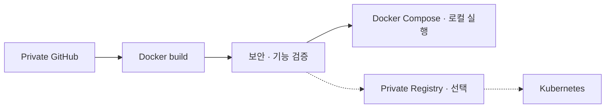

# Temp_log 기술 스택과 컨테이너 구조

글 작성부터 공개 페이지 렌더링까지 Ghost가 처리한다. 직접 관리하는 애플리케이션 코드는 한국어 Handlebars/CSS 테마뿐이며 별도 React SPA나 자체 인증 서버는 없다. 컨테이너는 역할에 따라 Ghost, MySQL, 로컬 메일함으로 나눈다.

## 현재 Docker Compose 구성

Ghost는 `app`과 `database` 두 네트워크에 연결된다. MySQL은 외부 인터넷 경로가 없는 `database`에만, Mailpit은 `app`에만 연결된다. MySQL 포트를 호스트에 공개하지 않는다. Mailpit이 받은 인증 메일은 로컬 메일함에서 확인하며 외부 수신자에게 전달하지 않는다.

| 역할 | 기술 / 이미지 | 저장·접근 방식 |
| --- | --- | --- |
| 공개 블로그 | 자체 Handlebars + CSS 테마 | Ghost가 서버에서 HTML 렌더링 |
| 관리자·인증·업로드 | Ghost 6.65.0 / Node.js 22 | `temp-log:local`, UID 1000, HTTP 2368 |
| DB | MySQL 8.4.11 LTS | `temp-log-db:local`, UID 999, 내부 TCP 3306 |
| 로컬 인증 메일 | Mailpit 1.31.3 | 내부 SMTP 1025, localhost UI 8025 |
| 영구 저장 | Docker named volumes | 글은 MySQL, 파일은 content 볼륨 |
| 실행·점검 | Make + Docker Compose | `make up`, `make status`, `make logs`, `make backup` |
| 검증 | GitHub Actions, GScan, Trivy, Python E2E | 빌드·취약점/SBOM·작성/업로드·재생성 검사 |

컨테이너 삭제와 데이터 삭제를 구분한다. `make down`은 컨테이너를 내리지만 두 named volume을 유지한다. `docker compose down -v`는 데이터를 지우므로 실사용 환경의 일반 종료 명령으로 사용하지 않는다.

## Kubernetes 운영 구성

아래는 저장소에 준비한 운영 구성이다. 현재 인터넷에 배포된 서비스라는 의미는 아니다. 실선은 기본 리소스·내부 연결, 점선은 운영자가 설정할 공개 경로·SMTP 또는 설정 주입이다.

- 기본 배포는 ClusterIP만 제공한다. `kubectl port-forward`로 최초 owner를 만든 뒤 공개 경로를 연다.
- 두 컨테이너 이미지와 테마는 Docker Compose와 Kubernetes에서 동일하게 사용한다. Kubernetes에서는 named volume 대신 PVC, `.env` 대신 Secret/ConfigMap을 사용한다.
- readiness는 DB 조회를 포함하는 홈페이지를 확인하고 liveness는 TCP 연결을 확인한다. MySQL 준비 전에는 init container에서 기다린다.
- Ghost는 단일 인스턴스와 로컬 파일 저장을 전제로 운영한다. 무중단·자동 수평 확장을 제공하는 구성은 아니다.
- NetworkPolicy의 통신 차단은 이를 집행하는 CNI가 필요하다. SMTP·도메인·TLS·스토리지 클래스 설정은 [Kubernetes 운영 안내](KUBERNETES.md)를 따른다.

## 이미지 생성과 검증

CI는 검증과 검사 결과·테마 ZIP 보관까지 수행한다. 레지스트리 push나 운영 클러스터 배포를 자동으로 수행하지 않는다. Ghost/MySQL 이미지의 기반 digest는 고정하지만 MySQL 보안 패키지 저장소는 갱신되므로 최종 운영 이미지는 빌드·검사 후 그 digest를 고정한다.

## 컨테이너 운영 기준

모든 서비스에 비루트 사용자, 읽기 전용 root filesystem, capability 제거, `no-new-privileges`, CPU/메모리/PID 제한과 로그 순환을 적용했다. 컨테이너 로그는 서비스별 `10m × 3`으로 제한하고 파일과 DB는 별도 볼륨에 보관한다. Ghost는 init 프로세스를 사용하며 정상 종료를 위해 최대 90초를 기다린다.

Ghost 이미지에는 상태 점검을 내장했다. Compose에서는 실행 주기만 조정하고 같은 점검 코드를 사용한다. Kubernetes는 매니페스트의 probes를 사용한다. Docker의 unhealthy 표시는 장애 감지용이며 그 상태만으로 컨테이너가 자동 재시작되는 것은 아니다.

설정 근거: [Docker Compose 서비스](https://docs.docker.com/reference/compose-file/services/), [내부 네트워크](https://docs.docker.com/reference/compose-file/networks/#internal), [Dockerfile HEALTHCHECK](https://docs.docker.com/reference/dockerfile/#healthcheck).
