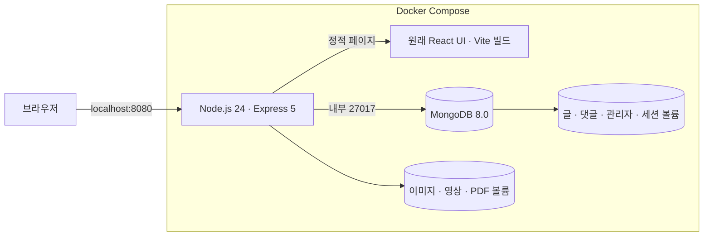
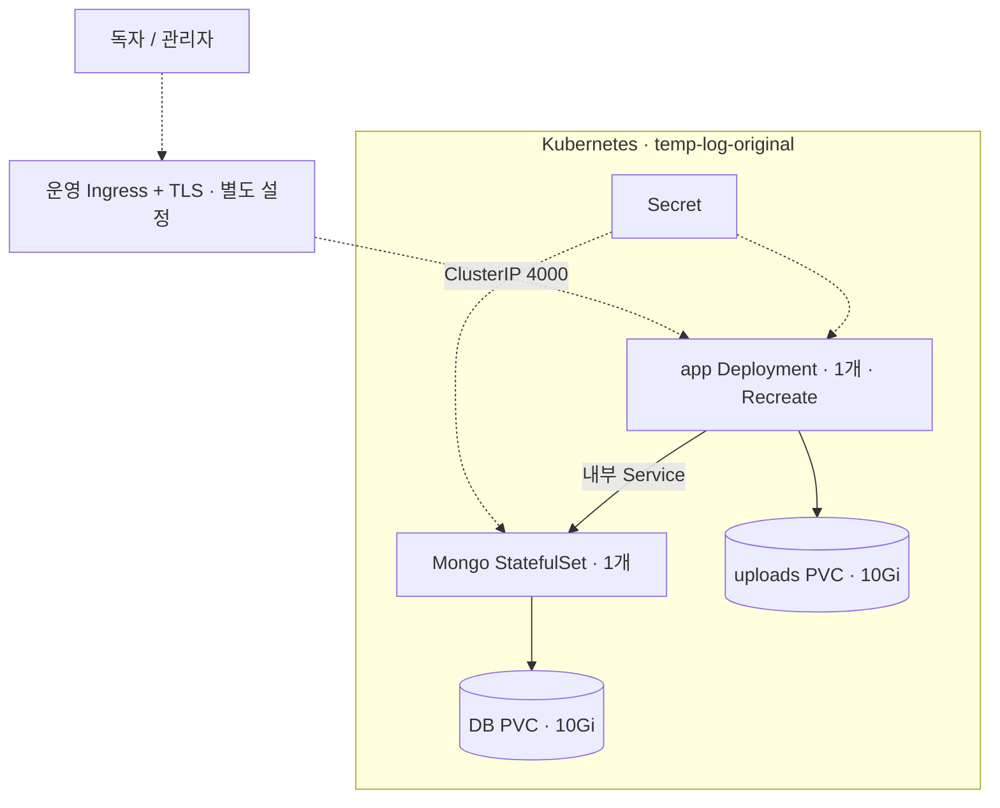

# 원래 앱의 기술 구조

원본의 React/Express/MongoDB 구조를 유지했다. Ghost, MySQL, Mailpit, Payload는 현재 실행 구성에 포함하지 않는다.

| 부분 | 유지한 기능과 기술 |
| --- | --- |
| 공개 화면 | 원래 Home/Gallery/PostDetail/Card 컴포넌트, React·Tailwind·Framer Motion |
| 관리자 | 원래 로그인·대시보드·Markdown 편집/미리보기, React Query·Zustand |
| 서버 | 원래 Express route/controller/model 구조, Node.js 24, Mongoose |
| 인증 | express-session + connect-mongo, HttpOnly/SameSite 쿠키, Origin 확인 |
| 업로드 | Multer, file-type, Sharp; UUID 파일·용량 한도 |
| 표시 | react-markdown + remark-gfm + rehype-raw + rehype-sanitize |
| 영구 저장 | MongoDB와 업로드 디렉터리를 각각 별도 볼륨에 보관 |
| 배포 | Docker 이미지 2개, Kustomize, app Deployment + Mongo StatefulSet |

API와 React 빌드를 같은 Express 컨테이너에서 제공해 기본 운영은 동일 출처다. Vite dev server는 개발할 때만 사용한다. 실행 이미지에는 Vite나 TypeScript 빌드 도구를 넣지 않는다.

글·댓글·세션은 MongoDB, 파일은 uploads에 저장한다. 파일 URL은 공개 자료용이고, 초안 본문만 인증 여부에 따라 구분한다. 단일 app 전제의 업로드/요청 제한이므로 HPA는 포함하지 않는다. Docker에서는 named volume, Kubernetes에서는 PVC를 사용한다. 자세한 절차는 [운영 안내](KUBERNETES.md)와 [백업·복구](RESTORE.md)에 있다.
