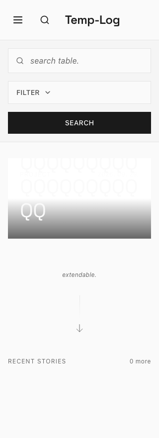
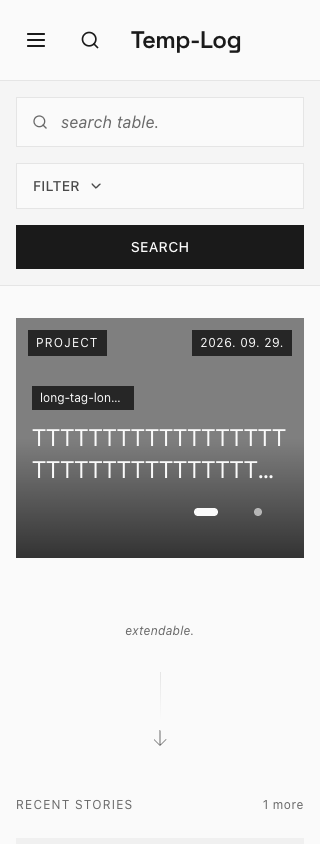
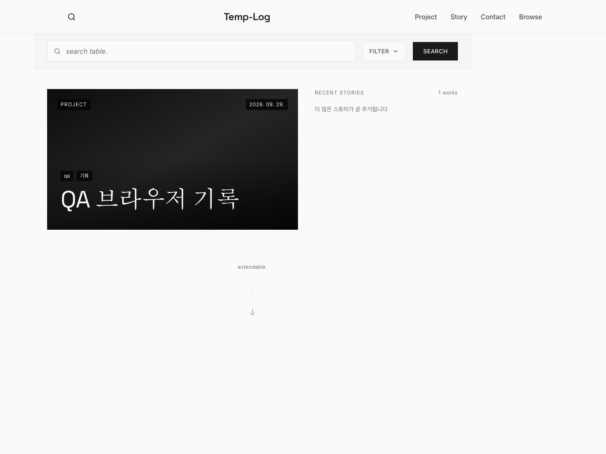
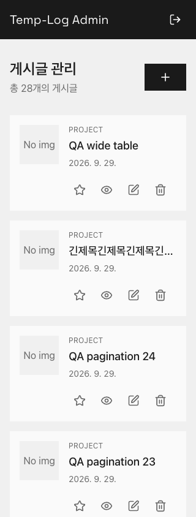

# Temp-Log 브라우저 QA와 개선

2026-09-29. 실제 Chrome을 Playwright로 조작했다. 단순 API 호출만으로 UI 성공을 판정하지 않고 로그인 폼, 편집기, 파일 선택, 공개/숨김 버튼, 검색, 댓글 삭제 대화상자, 키보드와 브라우저 이동을 사용했다. API 경계 공격·대량 페이지 준비·관리자 암호 초기화 등은 브라우저 요청/분리된 테스트 CLI로 보완했다.

QA 주소는 `localhost:8081`, Docker 프로젝트는 `temp-log-test-qa`다. 실행 전 URL의 포트가 해당 테스트 컨테이너와 일치하는지 확인한다. 실사용 `localhost:2368` 데이터·계정은 테스트에 사용하지 않았다. 테스트 DB/업로드 볼륨, 자격증명은 별도 보관하고 Git·CI 보고서에서 제외한다.

최종 로컬 결과: **브라우저 29/29, 백엔드 회귀 17/17 통과**. [기계 판독 가능한 결과](browser-qa-results.json).

## 최초 브라우저에서 확인한 실패

이전 실행 이미지에서 실제로 재현해 `artifacts/browser-qa/baseline.json`에 기록했다.

1. 제목·로고에 Arch-Log가 남아 있었다.
2. 없는 경로가 빈 화면으로 끝났다.
3. 썸네일을 삭제하고 저장해도 서버에 이전 URL이 남았다.
4. 공개 글이 있지만 홈 고정을 하지 않으면 “아직 게시글이 없습니다”라고 표시했다.
5. 검색창에서 Escape가 작동하지 않았다.
6. 한 탭에서 로그아웃해도 다른 탭의 관리자 화면이 남았다. 서버 쓰기 권한은 차단되었으므로 서버 인증 우회와는 구분한다.

## 적용한 개선

| 영역 | 수정 |
| --- | --- |
| 브랜딩 | 로고·문서 제목·관리자·서비스 로그·이미지 설명을 Temp-Log로 통일, T 파비콘. DB 이름과 기존 저장 데이터는 유지 |
| 편집 | 썸네일 빈 값 전송, 조회 실패 시 빈 편집기로 덮어쓰기 금지, 재시도, 공백/태그 제한, 저장 중 잠금 |
| 작성 내용 보호 | 이동/뒤로가기/새로고침 경고, 백그라운드 재조회가 작성 중인 내용을 덮지 않음 |
| 업로드 | 다중 파일을 순차 처리, 저장 버튼 잠금, 같은 파일 재시도, 잘못된 형식·크기·전체 용량 오류 표시 |
| 첨부 무결성 | 공개글·초안에서 사용 중인 파일 삭제409. HTML entity, URL 인코딩, 대소문자 경로 등 실제 표시 형태도 확인 |
| 인증 상태 | 로그아웃 탭 간 전달, 포커스 복귀 시 세션 확인, 보호된 캐시 제거, 오래된 요청의401이 새 로그인을 취소하지 않도록 세대 구분 |
| 목록·검색 | 잘못된 URL 값·페이지 교정, 정확한 빈 상태, 메뉴 활성 표시, 검색 입력과 URL 동기화 |
| 댓글 | 100개 이후 댓글 페이지, 전체 개수, 길이/UTF-8 암호 제한, 관리자 삭제 UI, 실제 오류/재시도, 모달 Enter/Escape·포커스 |
| 실패 처리 | 404와 서버/연결 오류 분리, 비정상 JSON 응답도 재시도 가능한 오류로 처리, JSON 용량 초과413 |
| 서버 입력 | 경로와 충돌하는 slug 차단, UUID slug, 안정적인 페이지 정렬, 공백 본문·미디어 페이지·제어문자 파일명 검증 |
| 대표 카드 | 흰 썸네일/200자 제목에서 잘리거나 겹치던 모바일 대표 카드 수정, 제목 줄 수/태그 폭과 grid 최소 폭 보정, 대비를 확보하는 캡션 배경, 44px 페이지 버튼과 별도 공간 |
| 접근성·반응형 | 검색 포커스 순환/복귀, 모바일 메뉴 Escape, 긴 본문/표/코드 가로 스크롤, 작은 화면의 관리자 버튼 배치, 보조 글씨·링크 대비 |

보조 글씨는 기존 #8a8a8a에서 #696969로 바꿨다. 밝은 배경 위 링크에는 별도 #846810 토큰을 사용하고 기존 금색 버튼 배경은 유지했다. 대비 측정은 해당 색 조합에 대한 것으로 전체 WCAG 인증을 의미하지 않는다.

## 브라우저 회귀 시나리오

`tests/browser/qa.spec.ts`에 다음 29개 시나리오를 자동화했다. 한 시나리오 안에 여러 정상·실패·복구 단계를 포함한다.

| 번호 | 확인 내용 |
| --- | --- |
| 01 | 이름·공개 메뉴·빈 홈·없는 경로·홈 복귀 |
| 02 | 비로그인 관리자 진입, 잘못된 로그인, 익명 쓰기 거부 |
| 03 | 공백 입력, 미저장 이동/뒤로가기/새로고침 경고와 취소 |
| 04 | UI에서 초안 작성, 썸네일·Markdown 이미지 업로드 |
| 05 | 익명 초안 목록/ID/slug/댓글 조회 차단 |
| 06 | 썸네일 삭제 저장, 참조 중 파일 삭제 거부, 제거 후 삭제 |
| 07 | PDF·실제 WebM 업로드, 가짜 이미지·SVG·25MiB 초과 파일 거부 |
| 08 | 저장 실패 후 입력 보존과 재시도 |
| 09 | 공개·홈 고정·숨김·재공개, 독자 화면·파일 다운로드 |
| 10 | 검색 URL/필터/입력 동기화, Escape·Tab·포커스 복귀 |
| 11 | 갤러리/관리자 페이지 이동, 잘못된 URL 복구 |
| 12 | 없는 글 편집 차단, 상세500·잘못된 응답 재시도 |
| 13 | 비회원 댓글 입력, 틀린 암호, Enter 삭제, 모달 오류 초기화 |
| 14 | 댓글 목록 장애·재시도와 관리자 중재 삭제 |
| 15 | 입력 변조, 큰 JSON, 실제 다른 출처의 쓰기, XSS/비허용 iframe 차단 |
| 16 | 모바일 탐색, 흰 이미지/200자 대표 제목의 겹침·잘림·대비, 긴 상세 본문, 블로그 소개·빈 이용약관 |
| 17 | 저장 중 중복 동작 방지, 삭제 취소·확정 |
| 18 | 다른 탭 로그아웃, 보호 화면 제거, 읽을 수 없는 세션 쿠키 |
| 19 | 서버에서 암호 초기화 후 기존 세션 폐기·로그인 유도 |
| 20 | 이전 세션의 지연된401이 새 로그인에 영향을 주지 않음 |
| 21 | 101개 댓글의 마지막 페이지까지 실제 접근 |
| 22 | 실제 QA DB 중단 → live200/ready503 → UI 오류 → DB 복구·재조회 |
| 23 | 실제 로그인 rate limit429와 안내 |
| 24 | 320/768px 화면, 표/코드 키보드 스크롤, 작은 관리자 화면 |
| 25 | 편집 중 재접속·백그라운드 재조회에도 입력 유지 |
| 26 | 지연된 다중 업로드가 끝날 때까지 저장 금지 |
| 27 | HTML entity·대소문자 파일 참조 보호 |
| 28 | 서버 전체 업로드 할당량 초과413·입력 보존 |
| 29 | UI에서 한국어 10만 자 본문 저장 |

파일/댓글 대량 데이터와 용량 경계는 테스트 환경에만 준비한다. 속도 제한은 끄지 않고 조회 윈도우를 지켜 시험한다. 본문 최대 길이·큰 JSON·업로드 제한·slug·첨부 참조·초안 권한은 백엔드 회귀 테스트 17개로도 확인한다.

## 실행과 기록

[README의 브라우저 QA 실행 방법](../README.md#브라우저-qa)을 따른다. 로컬 결과는 `artifacts/browser-qa/results.json`, 화면은 같은 폴더의 PNG다. CI에서도 Chromium을 설치해 같은 검사를 수행한다. 스크린샷은 등장 애니메이션이 끝난 후 촬영한다. 로그인/세션 trace나 테스트 비밀번호는 보고서에 포함하지 않는다.

## 범위의 한계

- Chrome/Chromium과 지정한 viewport 기준이다. 실제 iOS Safari/Android 단말, Firefox/WebKit 전체를 검증한 것은 아니다.
- 공개 배포의 TLS/Ingress/CNI, 외부 부하·장시간 사용·독립 침투시험은 별도 범위다.
- 업로드 파일 URL은 공개 자료용이라는 기존 설계를 유지한다. 초안 본문 비공개가 파일까지 비공개로 만들지는 않는다.
- 파일 형식/크기/이미지 처리와 다운로드 헤더를 확인했으며, 모든 PDF·영상의 악성코드 무해성을 증명하지 않는다.
- 참조 파일 삭제 보호는 데이터 손실을 막기 위한 보수적 검사다. 실제 운영 대규모 자료에 대한 성능/마이그레이션 검증은 별도로 필요하다.

## 화면 근거

아래는 테스트 전용 자료이며 실제 사용자 콘텐츠가 아니다.

밝은 썸네일·긴 제목의 수정 전:

같은 경계 조건을 수정 후 실제 업로드한 흰 이미지와 200자 제목으로 검증:

데스크톱과 320px 관리자 화면:

## 일반 개인 블로그로 변경

Temp-Log를 일상·생각 분류의 개인 블로그로 변경했다. 공개 화면의 개인 이름·연락처·소셜 프로필 영역과 건축 문구를 제거했고, `/about`에는 일반적인 블로그 소개만 표시한다. `/contact`는 `/about`으로 연결하며 `/terms`는 이용약관 제목만 표시한다. 기존 게시글의 내부 분류 값과 URL은 유지한다. 라이선스·출처 고지는 제품 소개와 구분하여 보존한다.

로컬 빌드와 실제 Chrome의 공개 경로 6개, 기존 연락처 주소 이동, 검색 분류, 모바일 메뉴, 320/1440px 가로 넘침 검사를 통과했다. 기존 29개 회귀 시나리오도 변경된 문구와 소개·약관 흐름에 맞췄다. 위 수정 전후 이미지는 앞선 QA 당시의 화면이다.
